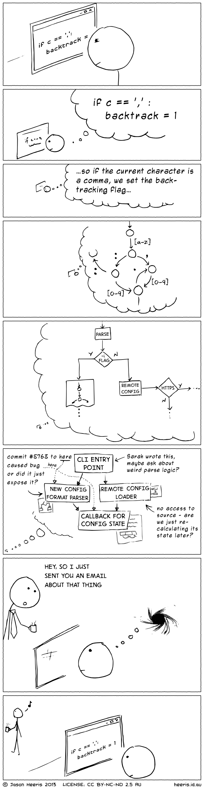

## Introduction

Generative AI tools have dramatically changed how software is written.

Today, tools such as GitHub Copilot and autonomous coding agents allow developers to generate code faster than ever before. Tasks that previously required hours of manual work, such as writing boilerplate code, generating documentation, or creating unit tests, can now be completed in seconds.

The result is a noticeable shift in development practice. Writing code is becoming easier, faster, and cheaper.

However, writing code has never been the most difficult part of software engineering. The real challenge lies in maintaining and evolving large systems over time.

As software systems grow, they accumulate complexity. Dependencies multiply, modules interact in unexpected ways, and small changes can have cascading effects throughout the system. This problem becomes even more apparent when AI agents attempt to operate on large codebases.

While AI tools perform well on small and well-defined tasks, they often struggle when modifications require understanding the broader structure of a complex system.

This raises a key question:

> Why do AI coding agents struggle with large codebases?

To answer this, we need to examine both empirical research and the structural nature of large software systems.

## AI Significantly Improves Developer Productivity

A growing body of research shows that generative AI tools can substantially improve developer productivity.

For example, Pandey et al. report that GitHub Copilot can reduce developer effort by **30–40% for repetitive coding tasks**, with even greater gains, up to **50% time savings**, for tasks such as documentation generation and code autocompletion [@pandey2024transformingsoftwaredevelopmentevaluating].

These improvements are particularly visible in tasks such as:

* boilerplate code generation
* documentation and comments
* repetitive coding patterns
* small functions within a limited context
* IDE-based code completion

In these situations, the scope of the task is relatively narrow. The model only needs to reason about a small portion of the codebase, and patterns from public repositories often apply directly to the task.

As a result, developers experience a noticeable reduction in manual effort.

However, these gains are not evenly distributed across all types of work.

## Where AI Tools Begin to Struggle

The same study by Pandey et al. also highlights several scenarios where GitHub Copilot becomes significantly less effective.

In particular, the tool struggles when tasks involve:

* large functions with complex internal logic
* modifications spanning multiple files
* proprietary or domain-specific business logic
* systems with deep dependency chains

In these situations, Copilot’s generated code often requires substantial manual correction.

Developers reported that while Copilot could assist with isolated parts of a problem, it was rarely able to implement tasks requiring coordinated changes across multiple files.

This limitation becomes especially clear in large, **interdependent enterprise systems**, where features are often implemented through interactions between many modules rather than within a single file.

These observations suggest that the core difficulty is not code generation, but operating within systems whose **structure does not constrain complexity**.

## The Real Challenge: Maintaining Evolving Systems

Large software systems are not simply collections of files.

They are **organized systems of interacting components**.

Over time, these systems evolve through a continuous cycle of change:

* requirements change
* features are added
* interfaces evolve
* modules interact in new ways

Maintaining stability while implementing these changes is one of the central challenges of software engineering.

Recent research has begun to evaluate whether AI agents can perform this kind of long-term maintenance.

Chen et al. introduce the **SWE-CI benchmark**, which evaluates the ability of AI agents to maintain codebases through repeated modification cycles rather than one-shot fixes [@chen2026swecievaluatingagentcapabilities].

Unlike traditional benchmarks that measure functional correctness on a single task, SWE-CI simulates real software evolution by requiring agents to modify codebases across dozens of iterations representing months of development history.

This evaluation approach reveals an important limitation.

Although modern models can generate **locally correct code patches**, they frequently introduce **regressions** when making repeated modifications to a codebase.

In other words, as of current benchmarks, AI agents struggle not with writing code once, but with **maintaining system stability over time**.

## Humans Face the Same Limitation

Interestingly, this limitation is not unique to AI.

Human developers also cannot fully understand large software systems.

In large organizations, no single engineer fully understands the entire system and critically, they are not expected to. Instead, the system is structured so that no individual needs to understand it in its entirety.

Large software systems are typically divided into:

* domains
* modules
* services
* teams responsible for specific components

This structure allows developers to work within bounded areas of responsibility without needing to understand the entire system.

In other words, complexity is managed through structure that constrains how components interact. To understand how, it helps to borrow a concept from organizational design: the distinction between **roles** (a function to be performed) and **entities** (the actor performing it).

For example, a system needs an *architect* role and a *programmer* role. In a human team, these might be different people, or even one person performing both roles.

## AI Agents Already Use Roles

This distinction is not just theoretical; modern AI agent systems have begun to adopt a similar structure.

The SWE-CI benchmark, for example, evaluates agents using a **dual-agent workflow** consisting of an Architect agent and a Programmer agent [@chen2026swecievaluatingagentcapabilities].

The Architect analyzes failing tests and produces a high-level requirement document.

The Programmer then modifies the codebase to implement those requirements.

This workflow mirrors how real software teams operate, where architectural decisions are separated from implementation.

However, this structure is still relatively simple compared to the organizational structures used in large engineering teams.

## The Organizational Hypothesis

This hypothesis makes a testable prediction: systems with clear architectural boundaries should be more amenable to AI-assisted development than those without them.

The main challenge in AI-driven software development is not the intelligence of the model itself, but the **structural viability of the systems it operates on**.

Large systems remain manageable because they are organized into smaller, semi-autonomous subsystems.

This principle is captured by the **Viable System Model (VSM)**, which explains how complex organizations remain stable through recursive structures. I discussed this idea in more detail in my earlier article, *[Recursive Architecture: Using the Viable System Model to Organize Codebases](../recursive-architecture-using-the-viable-system-model-to-organize-codebases)*.

In this model, operational units handle local tasks, while higher-level systems coordinate strategy, adaptation, and long-term planning.

Applied to software development, this suggests that AI agents should operate within clearly defined architectural boundaries rather than attempting to reason about an entire repository at once.

AI agents do not fail because models are weak; they fail because many codebases are structurally non-viable and present more variety than current models can handle.

::: {.callout-note}
The Viable System Model (VSM) describes how complex systems remain stable by organizing themselves into recursive layers. Each layer operates semi-independently, while higher layers coordinate strategy and adaptation across the system.

This structure allows large organizations to scale without requiring any single unit to understand the whole system.

:::

## Context Windows and Cognitive Limits

Both humans and AI systems face limits in how much information they can process at once.

For AI models, this limitation appears as the **context window**.

For humans, it appears as **cognitive load** and **context switching**.

Research in cognitive psychology consistently shows that multitasking carries measurable performance costs. When multiple tasks compete for attention, performance on individual tasks typically declines.

As summarized in a review of multitasking research:

> “Numerous studies showed decreased performance in situations that require multiple tasks or actions relative to appropriate control conditions.” @Koch2018Cognitive

These performance costs arise because tasks compete for limited cognitive resources and must often be processed sequentially rather than simultaneously.

Programming work is especially vulnerable to these effects because developers must maintain complex mental models of code, system behavior, and dependencies simultaneously.

Empirical software engineering research confirms that frequent switching between contexts harms productivity. A large-scale study of developers who use GitHub notes:

> “Multitasking, however, comes at a cognitive cost: frequent context-switches can lead to distraction, sub-standard work, and even greater stress.” @Vasilescu2016The

The same study explains why switching between programming tasks is particularly costly:

> “Switching to another task involves first retrieving its goal from memory… and this takes time.” @Vasilescu2016The

In practice, this means that developers must **reconstruct the working context** each time they resume a task.

This phenomenon explains why complex work does not scale well with constant interruptions or rapid switching between tasks.

Both humans and AI systems therefore require the same condition: **a structure that limits the scope of responsibility**.

Architecture and organizational structures exist precisely to enforce these boundaries. By dividing large systems into smaller, well-defined components, developers and increasingly AI agents can operate within manageable contexts.

Without such boundaries, both humans and AI systems struggle to manage complexity.

In this sense, software architecture is not only a technical design tool, it is also a **cognitive interface between humans, code, and increasingly AI agents**.

## Why More Context Alone Is Not the Solution

Many current AI development tools attempt to address context limitations by expanding the amount of code provided to the model.

Techniques such as vector databases and repository embeddings aim to retrieve relevant files from large codebases.

While these approaches improve information retrieval, they do not solve the underlying problem.

Architecture is not simply information; it is the **constraint system that makes complexity manageable**.

A system can contain all the information required for a task while still being difficult to modify if its responsibilities and boundaries are poorly defined.

Search can help locate code, but it cannot replace **the constraints that make a system navigable**.

## Conclusion

The implication is clear: the primary bottleneck in AI-driven software development is not model capability, but structural viability.

AI agents do not fail because they cannot write code. They fail because many codebases do not provide the constraints, boundaries, and organizational structure required to make complex systems navigable.

For AI agents to operate effectively at scale, they must be embedded in systems that are designed to manage complexity just as human organizations are.

The future of AI-assisted software development will depend not only on better models, but on building systems that constrain, coordinate, and structure their behavior.

In all cases, the pattern is the same: when systems lack structure, both humans and AI degrade in performance.

The limitation is not intelligence.

It is the absence of constraints.